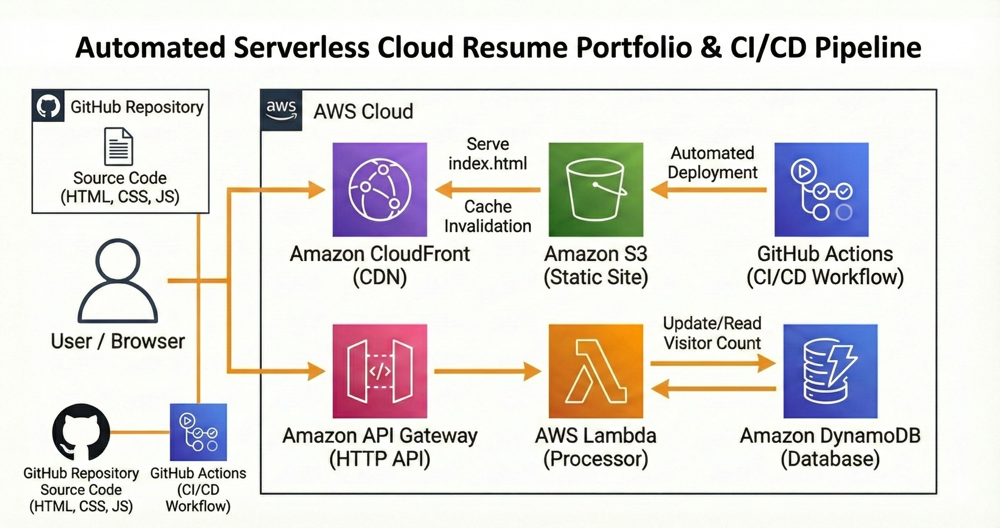
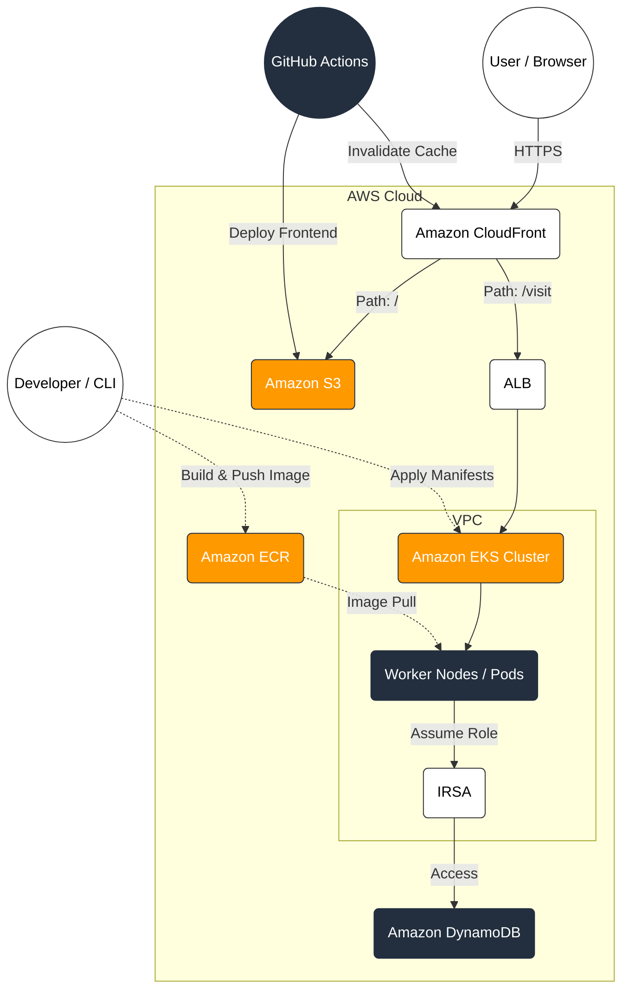

# AWS Cloud Resume: The Modernization Journey 🚀
### From Serverless (Lambda) to Cloud-Native (EKS)

This repository contains my personal Cloud Resume project, showcasing the evolution of a web application from a standard Serverless architecture to a robust, enterprise-grade **Kubernetes** environment.

---

## 🏗️ Phase 1: The Serverless Foundation (Legacy)
The project launched using a fully Serverless model to focus on rapid deployment and low maintenance.

****

* **Frontend:** Hosted on **Amazon S3** and distributed via **Amazon CloudFront** for global caching.
* **Backend:** **AWS Lambda** functions triggered by **Amazon API Gateway**.
* **Database:** **Amazon DynamoDB** for persistent visitor counting.
* **Status:** Deprecated (Found in `backend/legacy-lambda/`).

---

## ⚙️ Automated Deployment (CI/CD)
From day one, the frontend deployment has been fully automated to ensure consistency and high availability.
* **Workflow:** A **GitHub Actions** pipeline triggers on every push to `main`.
* **S3 Sync:** The workflow authenticates with AWS and syncs the updated `index.html` to the **Amazon S3** bucket.
* **Cache Invalidation:** Automatically creates a **CloudFront Invalidation** to ensure users instantly see the latest version, bypassing the edge cache.

---

## 🏗️ Phase 2: Kubernetes Modernization (Current)
To demonstrate scalability and advanced orchestration, I migrated the **backend** from Lambda to **Amazon EKS (Kubernetes)** and automated the infrastructure provisioning.



### **The Migration & New Stack**
* **Orchestration:** Migrated from Lambda to **Amazon EKS** (Managed Kubernetes).
* **Containerization:** Packaged the Python API into **Docker** containers hosted on **Amazon ECR**.
* **Infrastructure as Code:** Replaced manual clicks with **Terraform** to provision the VPC, EKS Cluster, and Networking.
* **Networking:** Replaced API Gateway with an **Application Load Balancer (ALB)** managed by Kubernetes.

---

## 🛡️ Key Engineering Challenges & Solutions

### 1. **Zero-Trust Security with IRSA**
Instead of using long-lived AWS Access Keys, I implemented **IAM Roles for Service Accounts (IRSA)**.
* **The Logic:** Kubernetes Pods assume temporary IAM roles via an OIDC provider.
* **The Result:** Enhanced security following the **Principle of Least Privilege**.

### 2. **Networking & Reverse Proxy Logic**
To solve **Mixed Content** issues and simplify the frontend architecture, I re-configured **Amazon CloudFront** to act as a reverse proxy.
* `/` -> Routes to S3 (Static Content).
* `/visit` -> Routes to the EKS Load Balancer (Dynamic API).

### 3. **Infrastructure as Code (IaC)**
The entire AWS environment (VPC, Subnets, NAT Gateways, EKS, IAM) is now managed via **Terraform** to ensure consistency and prevent configuration drift.

---

## 📁 Project Structure

* `📂 architecture-diagrams/`: Old and new architecture diagrams.
* `📂 backend/`: Python API and Docker configuration.
* `📂 backend/legacy-lambda/`: The original serverless implementation.
* `📂 infrastructure/`: Terraform modules for AWS resources.
* `📂 k8s-manifests/`: Kubernetes Deployment, Service, and ServiceAccount definitions.
* `📂 frontend/`: Contains the index.html with embedded JS logic.

---

## 🚀 Deployment Guide

1. **Provision Infrastructure:**
    ```bash
    cd cloud-resume-infra
    terraform init && terraform apply
    ```
2. **Apply K8s Configurations:**
    ```bash
    kubectl apply -f k8s-manifests/service-account.yaml
    kubectl apply -f k8s-manifests/deployment.yaml
    ```

---
> **Outcome:** This project demonstrates my ability to bridge the gap between software development and cloud operations, handling security, networking, and orchestration at scale.