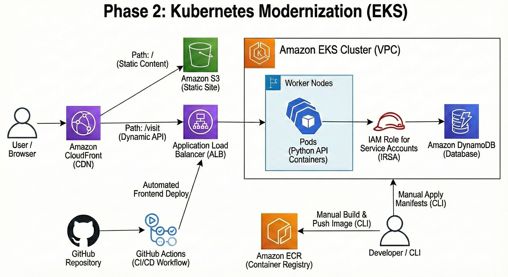

# AWS Cloud Resume: The Architectural Evolution & Cost Optimization 🚀
### From Serverless (Lambda) ➡️ Cloud-Native (EKS) ➡️ Strategic Serverless (FinOps)

> **Executive Summary:** This project showcases my journey as a **3x AWS Certified Cloud Professional** (Cloud Practitioner, AI Practitioner, Solutions Architect Associate) and **CKA Candidate**. It demonstrates the ability to architect, migrate, and optimize enterprise-grade infrastructures while making data-driven decisions based on performance, complexity, and cost-efficiency.

---

## 🏗️ Phase 1: The Serverless Foundation (Legacy)
The project launched using a fully Serverless model to focus on rapid deployment and low maintenance.

****

* **Frontend:** Hosted on **Amazon S3** and distributed via **Amazon CloudFront** for global caching.
* **Backend:** **AWS Lambda** functions triggered by **Amazon API Gateway**.
* **Database:** **Amazon DynamoDB** for persistent visitor counting.
* **Status:** Deprecated (Found in `backend/legacy-lambda/`).

---

## ⚙️ Automated Deployment (CI/CD)
From day one, the frontend deployment has been fully automated to ensure consistency and high availability.
* **Workflow:** A **GitHub Actions** pipeline triggers on every push to `main`.
* **S3 Sync & Invalidation:** Ensures the latest frontend is served via CloudFront instantly.
* **IaC Consistency:** All infrastructure components (VPC, IAM, Lambda, S3) are managed via **Terraform** to prevent configuration drift.

---

## 🏗️ Phase 2: Kubernetes Modernization (Current)
To demonstrate scalability and advanced orchestration, I migrated the **backend** from Lambda to **Amazon EKS (Kubernetes)** and automated the infrastructure provisioning.

****

### **The Migration & New Stack**
* **Orchestration:** Migrated from Lambda to **Amazon EKS** (Managed Kubernetes).
* **Containerization:** Packaged the Python API into **Docker** containers hosted on **Amazon ECR**.
* **Infrastructure as Code:** Replaced manual clicks with **Terraform** to provision the VPC, EKS Cluster, and Networking.
* **Networking:** Replaced API Gateway with an **Application Load Balancer (ALB)** managed by Kubernetes.

---

## 🏗️ Phase 3: The FinOps Pivot - Strategic Return to Serverless (Current)
After successfully demonstrating enterprise orchestration with EKS, I performed a **Cost-Benefit Analysis**. For a portfolio-scale application, the operational overhead and fixed costs of an EKS cluster were not justified.

### **The Decision: Right-Sizing for Value**
* **Cost Optimization:** Migrated back to **AWS Lambda** to leverage a 100% "Pay-as-you-go" model, reducing compute costs to near-zero.
* **Architectural Maturity:** Proven ability to choose the **Right Tool for the Job** rather than just the most complex one.
* **Hybrid Approach:** The Terraform logic remains in the repo, proving that the infrastructure is ready to scale back to EKS instantly if business requirements change.
* **Status:** **Active Production Environment.**

---

## 🛡️ Key Engineering Challenges & Solutions

### 1. **Zero-Trust Security with IRSA**
Instead of using long-lived AWS Access Keys, I implemented **IAM Roles for Service Accounts (IRSA)**.
* **The Logic:** Kubernetes Pods assume temporary IAM roles via an OIDC provider.
* **The Result:** Enhanced security following the **Principle of Least Privilege**.

### 2. **Networking & Reverse Proxy Logic**
To solve **Mixed Content** issues and simplify the frontend architecture, I re-configured **Amazon CloudFront** to act as a reverse proxy.
* `/` -> Routes to S3 (Static Content).
* `/visit` -> Routes to the API (Lambda/EKS).

### 3. **Infrastructure as Code (IaC)**
Managed the entire lifecycle of multi-service architectures using **Terraform** modules for reusability and scalability.

---

## 📁 Project Structure

* `📂 architecture-diagrams/`: Old and new architecture diagrams.
* `📂 backend/`: Python API and Docker configuration.
* `📂 backend/legacy-lambda/`: The original serverless implementation.
* `📂 infrastructure/`: Terraform modules for AWS resources.
* `📂 k8s-manifests/`: Kubernetes Deployment, Service, and ServiceAccount definitions.
* `📂 frontend/`: Contains the index.html with embedded JS logic.

---

## 🚀 Deployment Guide (For EKS version)

1. **Provision Infrastructure:**
    ```bash
    cd infrastructure
    terraform init && terraform apply
    ```
2. **Apply K8s Configurations:**
    ```bash
    kubectl apply -f k8s-manifests/service-account.yaml
    kubectl apply -f k8s-manifests/deployment.yaml
    ```

---
> **Outcome:** This project is a living testament to my evolution as a Cloud Engineer. It proves I can build with Serverless speed, scale with Kubernetes power, and optimize with an Architect's financial mindset.